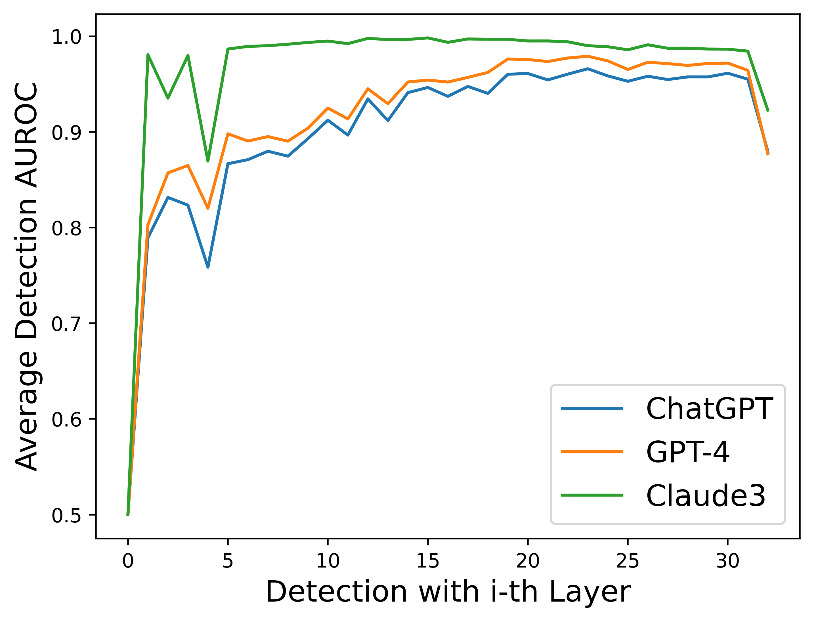

# 🔍 Text Fluoroscopy: Detecting LLM-Generated Text through Intrinsic Features (EMNLP 2024 Main Track)

[](https://aclanthology.org/2024.emnlp-main.885.pdf)
[](https://github.com/Fish-and-Sheep/Text-Fluoroscopy)
[](https://www.python.org/downloads/)

**Text Fluoroscopy**: we propose Text Fluoroscopy, a black-box method for LLM-generated text detection through intrinsic features. Our method captures the text’s intrinsic features by identifying the layer with the largest distribution difference from the last and first layers when projected to the vocabulary space.
<!--  -->
<div style="text-align: center;">
  
</div>


## 📋 Overview

Most LLM detection methods focus on either semantic features (from the last layer) or simple linguistic features (from early layers). **Text Fluoroscopy** takes a different approach by:

1. Finding the model layer with the largest distribution difference from both first and last layers
2. Extracting intrinsic text features that reveal the actual "fingerprints" of AI generation
3. Achieving superior generalization and robustness across different domains and against paraphrase attacks

## 🚀 Getting Started

### Prerequisites
- Python 3.8+
- PyTorch 1.10+
- CUDA-compatible GPU

### Installation

```bash
git clone https://github.com/Fish-and-Sheep/Text-Fluoroscopy.git
cd Text-Fluoroscopy
pip install -r requirements.txt
```

### Step 1: Download the LLM Model

```bash
huggingface-cli download --resume-download Alibaba-NLP/gte-Qwen1.5-7B-instruct \
  --local-dir ../huggingface_model/gte-Qwen1.5-7B-instruct \
  --cache-dir ../huggingface_model/gte-Qwen1.5-7B-instruct \
  --local-dir-use-symlinks False
```

### Step 2: Extract Features and Calculate KL Divergence

```bash
python gte-qwen/save_KL_with_first_and_last_layer.py

python gte-qwen/save_embedding.py
```

### Step 3: Train Classifier and Test

```bash
python embedding_classify/classify_with_max_KL_layer.py
```

## ⚡ Optimization Strategies

Although our dynamic layer-selection method is effective, the computational overhead of examining each layer introduces time delays. To address this limitation, we provide an alternative approach:

| Methods | ChatGPT | GPT-4 | Claude3 |
|------------------|---------|-------|---------|
| Detection with the Last Layer | 0.07s | 0.09s | 0.08s |
| Text Fluoroscopy | 0.52s | 0.51s | 0.49s |
| Detection with the 30-th layer | 0.08s | 0.08s | 0.07s |

As shown above:
- We identified that using the fixed 30th layer offers an excellent balance between accuracy and speed
- This optimization reduces processing time by ~6.5× with less than 0.7% accuracy reduction
- The 30th layer approach maintains the core benefits of our method while being nearly as fast as last-layer-only methods

<div style="text-align: center;">
  
</div>

## 🔄 Applicability Across LLMs

Text Fluoroscopy is not limited to a specific encoder model. We tested our approach with multiple LLMs to demonstrate its broad applicability:

| LLM | Layer | ChatGPT |  |  |  | GPT-4 |  |  |  | Claude3 |  |  |  |
|------------------|--------|---------|---------|---------|---------|---------|---------|---------|---------|---------|---------|---------|---------|
|  |  | XSum | Writing | PubMed | Avg. | XSum | Writing | PubMed | Avg. | XSum | Writing | PubMed | Avg. |
| gte-Qwen2-7B | Last | 0.9658 | 0.9710 | 0.6186 | 0.8518 | 0.9711 | 0.9758 | 0.6847 | 0.8772 | 0.9472 | 0.9836 | 0.8011 | 0.9106 |
|  | Middle | **0.9988** | **0.9834** | **0.7744** | **0.9189** | **0.9996** | **0.9872** | **0.8416** | **0.9428** | **0.9994** | **0.9953** | **0.9373** | **0.9773** |
| stella_en_1.5B_v5 | Last | 0.8928 | 0.9802 | 0.6966 | 0.8565 | 0.8996 | 0.9708 | 0.7293 | 0.8666 | 0.8971 | 0.9758 | 0.8646 | 0.9125 |
|  | Middle | **1.0000** | **0.9921** | 0.6611 | **0.8844** | **1.0000** | **0.9873** | 0.6955 | **0.8943** | **0.9997** | **0.9834** | **0.8955** | **0.9595** |
| GPT-neo-2.7B | Last | 0.6270 | 0.7190 | 0.6079 | 0.6513 | 0.7317 | 0.7970 | 0.4883 | 0.6724 | 0.9674 | 0.9981 | 0.8769 | 0.9475 |
|  | Middle | **0.8568** | **0.8916** | 0.6079 | **0.7854** | **0.9005** | **0.9137** | **0.5027** | **0.7723** | **0.9945** | 0.9933 | **0.9350** | **0.9743** |

As shown in the table above:

- Our method consistently outperforms the last-layer approach across different encoder architectures
- We tested with both advanced models (gte-Qwen2-7B, stella_en_1.5B_v5) and classical models (GPT-neo-2.7B)
- The improvement is especially significant when detecting ChatGPT and GPT-4 generated content
- This demonstrates that Text Fluoroscopy's core principle of leveraging intrinsic features from middle layers is valid across LLM architectures


## 📚 Citation

If you find our work useful, please consider citing our paper:

```bibtex
@inproceedings{yu2024textfluoroscopy,
    title={Text Fluoroscopy: Detecting LLM-Generated Text through Intrinsic Features},
    author={Yu, Xiao and Chen, Kejiang and Yang, Qi and Zhang, Weiming and Yu, Nenghai},
    booktitle={Proceedings of the 2024 Conference on Empirical Methods in Natural Language Processing (EMNLP)},
    year={2024},
    url={https://aclanthology.org/2024.emnlp-main.885.pdf}
}
```

## 📬 Contact

For questions or feedback, please open an issue or contact us at [Xiao Yu](mailto:yuxiao1217@mail.ustc.edu.cn).
