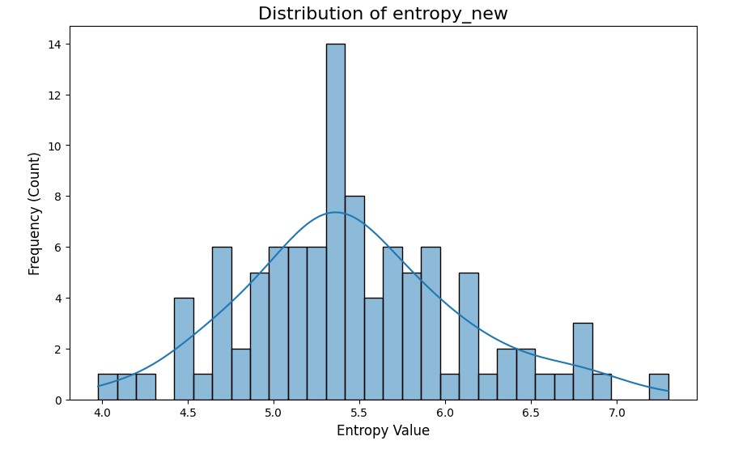
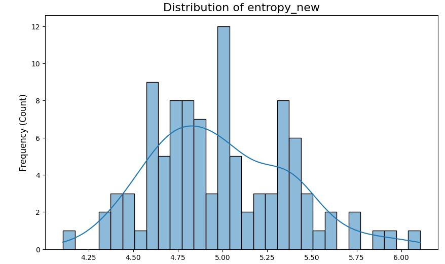
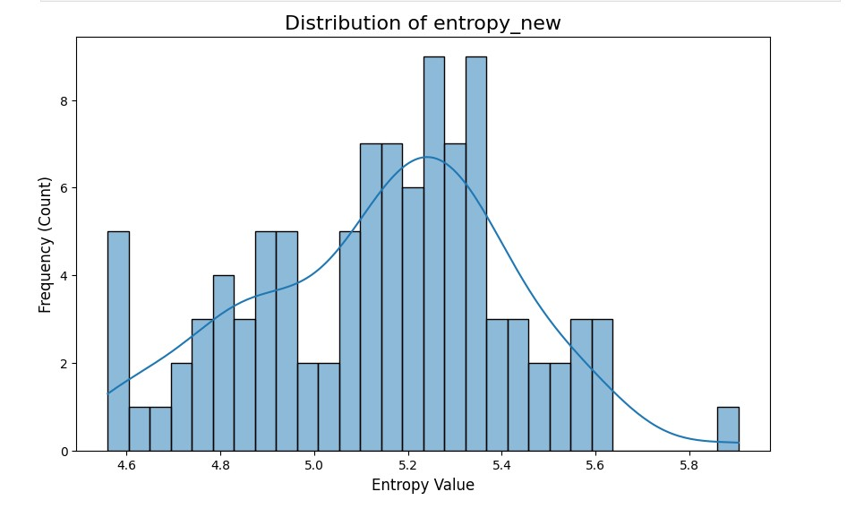

# Statistical Analysis of Human vs AI Generated Text

## 📌 Overview
The Statistical Analysis folder contains a analysis comparing **human-written** text with **AI-generated** text using entropy-based metrics.  
The core objective is to explore whether **Entropy distributions** can help distinguish between human authorship and outputs from modern large language models.

---

## 📂 Data Sources

### **1. Human-Generated Text**
We used the *Human vs AI Text* dataset from Kaggle:  
🔗 https://www.kaggle.com/datasets/shanegerami/ai-vs-human-text

### **2. Writing Prompts for AI Generation**
Prompts were taken from the HuggingFace WritingPrompts dataset:  
🔗 https://huggingface.co/datasets/euclaise/writingprompts

---

## 🤖 AI Models Used
The following models were used to generate AI-written paragraphs:

- **deepseek-r1:latest**
- **qwen2.5:7b**
- **llama3.2**

---

## 🧪 Methodology

1. Collected human-written text samples from Kaggle  
2. Sampled prompts from WritingPrompts  
3. Generated AI text using the selected models  
4. Computed entropy metrics:
   - Token entropy  
   - Normalized entropy  
   - Sequence-average entropy  
5. Visualized the distributions through histograms

All plots are saved in the **`figures/`** folder.

---

## 📊 Visualizations

### **Human-written text entropy distribution**

### **LLaMA 3.2 text entropy distribution**

### **Qwen2.5 7B text entropy distribution**

# **AI vs Human Text Classification using Qwen-1.5B + Binary Classifiers**
We use:
- **Qwen-1.5B** as the feature extractor  
- Used the scoring metric for selecting the layer to extract the feature vectors as the Paper Text Fluoroscopy
- Three binary classifiers:
  - **Multi-Layer Perceptron (MLP)**
  - **Random Forest (RF)**
  - **Support Vector Machine (SVM)**

The models are trained on the combined features and evaluated on two different test splits:
1. **gpt4-pub-gpt3**
2. **gpt4-writing-gpt3**

All metrics reported:  
**Accuracy, AUROC, Precision, Recall, F1-Score, Confusion Matrix**

---

# **📊 Results**

Below are the results of all classifiers on **Validation** and the two test sets.

---

# **1️⃣ MLP Classifier Results**

## **Validation**
| Metric | Score |
|-------|-------|
| Accuracy | 0.8255 |
| AUROC | 0.8942 |
| Precision | 0.8702 |
| Recall | 0.7651 |
| F1 | 0.8142 |
| Confusion Matrix | [[132, 17], [35, 114]] |

---

## **Test: gpt4-pub-gpt3**
| Metric | Score |
|-------|-------|
| Accuracy | 0.5503 |
| AUROC | 0.5739 |
| Precision | 0.6271 |
| Recall | 0.2483 |
| F1 | 0.3557 |
| Confusion Matrix | [[127, 22], [112, 37]] |

---

## **Test: gpt4-writing-gpt3**
| Metric | Score |
|-------|-------|
| Accuracy | 0.77 |
| AUROC | 0.8619 |
| Precision | 0.8403 |
| Recall | 0.6667 |
| F1 | 0.7435 |
| Confusion Matrix | [[131, 19], [50, 100]] |

---

# **2️⃣ Random Forest Results**

## **Validation**
| Metric | Score |
|-------|-------|
| Accuracy | 0.7550 |
| AUROC | 0.8877 |
| Precision | 0.7 |
| Recall | 0.8926 |
| F1 | 0.7846 |
| Confusion Matrix | [[92, 57], [16, 133]] |

---

## **Test: gpt4-pub-gpt3**
| Metric | Score |
|-------|-------|
| Accuracy | 0.4731 |
| AUROC | 0.4711 |
| Precision | 0.4737 |
| Recall | 0.4833 |
| F1 | 0.4784 |
| Confusion Matrix | [[69, 80], [77, 72]] |

---

## **Test: gpt4-writing-gpt3**
| Metric | Score |
|-------|-------|
| Accuracy | 0.7466 |
| AUROC | 0.8453 |
| Precision | 0.7434 |
| Recall | 0.7533 |
| F1 | 0.7483 |
| Confusion Matrix | [[111, 39], [37, 113]] |

---

# **3️⃣ SVM Results**

## **Validation**
| Metric | Score |
|-------|-------|
| Accuracy | 0.8691 |
| AUROC | 0.9612 |
| Precision | 0.9167 |
| Recall | 0.8121 |
| F1 | 0.8612 |
| Confusion Matrix | [[138, 11], [28, 121]] |

---

## **Test: gpt4-pub-gpt3**
| Metric | Score |
|-------|-------|
| Accuracy | 0.5234 |
| AUROC | 0.4970 |
| Precision | 0.5479 |
| Recall | 0.2684 |
| F1 | 0.3604 |
| Confusion Matrix | [[116, 33], [109, 40]] |

---

## **Test: gpt4-writing-gpt3**
| Metric | Score |
|-------|-------|
| Accuracy | 0.83 |
| AUROC | 0.8951 |
| Precision | 0.9159 |
| Recall | 0.7267 |
| F1 | 0.8104 |
| Confusion Matrix | [[140, 10], [41, 109]] |

---

